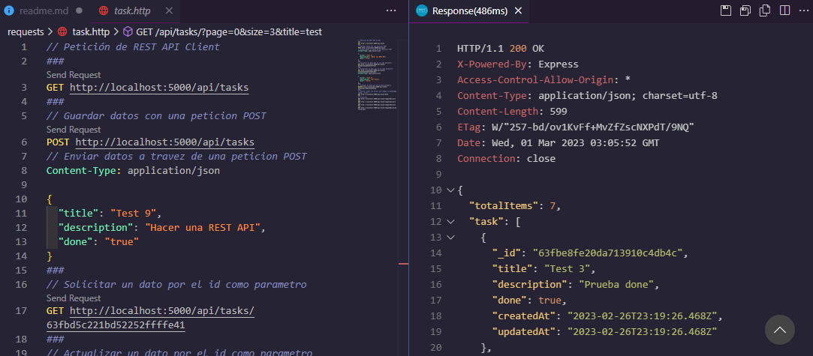
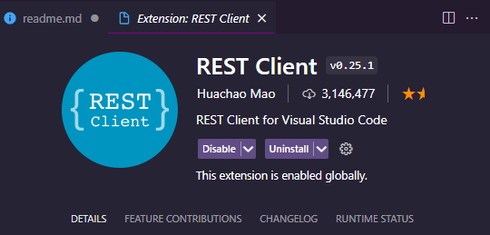
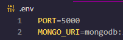

# API REST con NodeJS y Mongo DB



## Descripción

Una API REST con NodeJS y MongoDB usando un Babel como compilador para que la API funcione en sistemas legacy.

<div align="center">


</div>

## Instrucciones

Para Ejecutar el proyecto debes seguir los pasos siguientes:

- Tener REST Client instalado en VS CODE o cualquier API Tester

<div align = "center"> 



</div>

- Ejecutar el comando:

```
 $ npm install
```

- Crear un archivo .env en la raiz del proyecto y agregar las variables PORT y MONGO_URI

<div align = "center"> 



</div>

- Ejecutar babel para producción

```
 $ npm run build
```

- Ejecutar el Proyecto


```
 $ npm run start
```

- Puedes ejecutar las peticiones de la carpeta "request" o hacer las tuyas.

<div align = "center"> 


</div>
